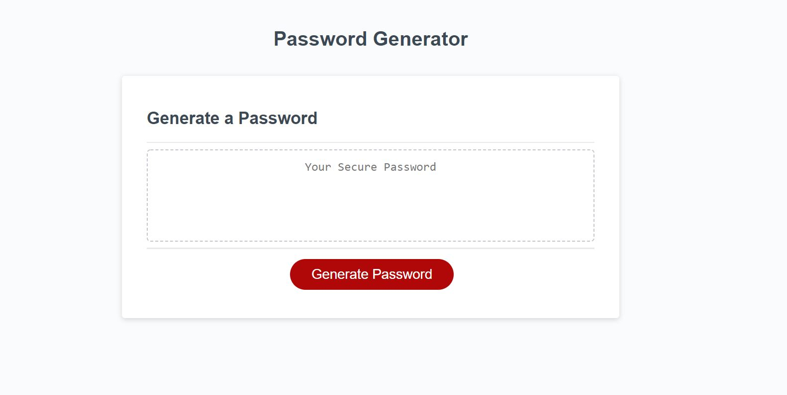

# Random Password Generator

##Value Add Proposal

Create javascript functions that allow existing html page to be used to generate a random password between of no less than 8 and no more than 128 characters in length, and allow users to choose whether or not to include lowercase letters, uppercase letters, numbers, and a range of special characters.

##Phase one - Starter code

Function declaration to write password according to undefined generatePassword function already defined, along with code to print the results to existing html text area element and an event listener for the generate button to begin the process.

##Phase two - User input

Function begins by prompting the user to enter a number of characters to determine the length of the final password. This input will be saved as a variable for use later in the function.

Confirm pop-ups are then used to determine truthiness of the inclusion of lowercase letters, uppercase letters, numbers, and special characters. Truthiness of these variables is logged to console for testing and debugging purposes.

##Phase three - Determining character array of password.

For each of the four possible character classifications, an array is created containing each possible character within that classification. A series of if/else statements follow which concatenate all enabled arrays according to the truthiness of each classification's related variable.

##Phase four - Password generation

A new variable (pwdString) is created to contain the randomly selected characters to form a string to be fed into the final password variable.

for loop is created to iterate for a number of times equal to the user input for password length. += operator is applied with a floored math.random method multiplied by the length of the previously determined array of approved characters. This combines randomly selected characters into a string value for pwdString which is returned at the end of the generatePassword function. This value is then fed through the writePassword function, which then adds it to the existing html text area via the textContent method.

